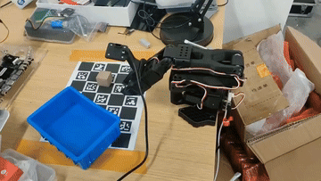

# SO-101 机械臂 · 单目视觉抓取放置（Pick & Place）

基于 **LeRobot** 与 **单目眼在手（eye-in-hand）视觉** 实现的机械臂自主抓取放置项目：
YOLO 检测物块与目标框 → 单目相机 + 平面假设解算 3D 位置 → IK 运动学规划 → 闭环抓取放置。

- 硬件：SO-101 从臂（6 × Feetech 舵机：5 个臂关节 + 1 个夹爪）+ 装在从臂上的单目 USB 摄像头
- 软件：Ubuntu 22.04 虚拟机 / Python 3.12 / LeRobot（main 分支）/ OpenCV 4.13 / YOLO26n / PyBullet
- 方案：不依赖背景、不依赖物块颜色大小的**模块化管线**（感知 + 规划），机械臂可移动、可换环境

---

## 特性

- 🎯 **泛化**：颜色 / 大小 / 光照 / 背景变化不影响（检测靠 YOLO，位置靠标定 + 几何）
- 📷 **只用 1 个摄像头**：装在从臂上（eye-in-hand），通过手眼标定 + 桌面平面假设解 3D
- 🦾 **可移动机械臂**：位置在机械臂基座坐标系下计算，底座移动不影响（重标定桌面即可）
- 🔁 **闭环**：抓取前重检测、下降接触停止、放框前重检测框，自动纠偏
- 🛡️ **安全**：慢速分段、到位等待、结束自动回初始姿态后再断电

## 🎬 演示



> 上面是自动循环播放的演示动图；完整视频：[media/demo.mp4](media/demo.mp4)
> 演示：YOLO 检测 → 单目 3D 定位 → IK 规划 → 抓取放置（SO-101 从臂）

## 目录结构

```
pick_place/
├── README.md
├── docs/                        # 教程文档（从环境搭建到调参）
├── robot_lib.py                 # 公共库：连接机械臂 / FK / IK / 标定板检测
├── step1_charuco.py             # 生成标定板
├── step2_intrinsics.py          # 相机内参标定
├── step3a_collect_handeye.py    # 手眼标定数据采集（键盘控制机械臂）
├── step3b_calib_handeye.py      # 手眼标定计算 + 验证
├── step3d_diag.py               # 标定诊断
├── step3e_order_test.py         # marker 角点顺序测试
├── step4_calib_table.py         # 桌面平面标定
├── step5_collect_yolo.py        # 采集 YOLO 训练数据
├── step6_detect_preview.py      # YOLO 检测预览
├── step7_live.py                # 实时 3D 位置显示（调试用）
├── step7_pick_place.py          # ★ 主程序：抓取放置
├── test_camera.py               # 摄像头方向测试
├── gripper_test.py              # 夹爪开合值测试
├── sim_env.py                   # PyBullet 仿真（可选）
├── calib/                       # 标定结果（内参 / 手眼 / 桌面平面）
├── datasets/raw/                # YOLO 原始数据
├── weights/best.pt              # YOLO 模型
├── urdf_so101/                  # SO-101 官方校准 URDF + 3D 模型
└── debug/                       # 运行日志（带标注的图 + JSON）
```

## 快速开始

```bash
# 1) 环境准备（详见 docs/01-环境搭建.md）
conda activate lerobot
pip install opencv-contrib-python==4.13.0.92 ultralytics scipy pybullet

# 2) 标定（详见 docs/02-标定流程.md）
python step1_charuco.py        # 打印标定板
python step2_intrinsics.py     # 相机内参
python step3a_collect_handeye.py --robot.type=so101_follower --robot.port=/dev/ttyACM0 --robot.id=so101_follower
python step3b_calib_handeye.py
python step4_calib_table.py

# 3) YOLO 训练（详见 docs/03-YOLO数据与训练.md）
#    采集 -> Windows 标注训练 -> best.pt 拷回 weights/

# 4) 运行（详见 docs/04-主程序与调参.md）
python step7_pick_place.py --robot.type=so101_follower --robot.port=/dev/ttyACM0 --robot.id=so101_follower
```

## 文档目录

| 文档 | 内容 |
|---|---|
| [docs/00-零基础教程.md](docs/00-零基础教程.md) | ⭐ 零基础手把手教程（跟着做，从零到抓取放置） |
| [docs/01-环境搭建.md](docs/01-环境搭建.md) | Ubuntu 虚拟机 + LeRobot 环境配置（含 main 分支 API 差异） |
| [docs/02-标定流程.md](docs/02-标定流程.md) | 相机内参 / 手眼标定 / 桌面平面（含所有坑） |
| [docs/03-YOLO数据与训练.md](docs/03-YOLO数据与训练.md) | 数据采集 / 标注 / 训练 / 部署 |
| [docs/04-主程序与调参.md](docs/04-主程序与调参.md) | 抓取流程 / 全部参数 / 调参方法 |
| [docs/05-常见问题与解决方案.md](docs/05-常见问题与解决方案.md) | 环境 / 标定 / 运动学 / 硬件问题排查 |
| [docs/06-源码说明.md](docs/06-源码说明.md) | 文件清单 / 函数说明 / 数据格式 |

## 说明

- 项目路径约定：`/home/x/robot_learning/pick_place`（Windows 侧为 `C:\My_shuju\x\pick_place`）
- 机器人 id：`so101_follower`（校准文件按 id 保存）
- 详细的环境依赖与版本坑，见 `docs/01-环境搭建.md`


